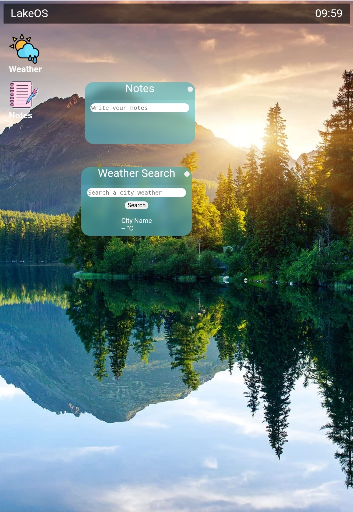

# myOS
Hi, this is my first try of make a OS, i'm doing it with star dance hacktime using css, html and javascript

## What you can do
So far, you only can write a note and check the weather of a city. You also can move the windows of the icons. I'm working to improve the project and add more icons and functions.

