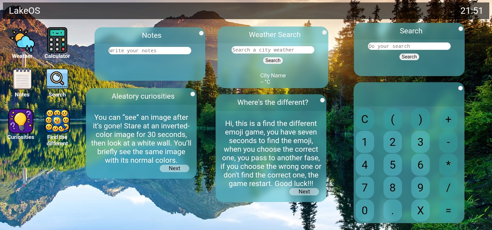

# myOS
Hi, this is my first try of make a OS, i'm doing it with star dance hacktime using css, html and javascript

## What you can do
* Write notes
* Check the weather of any city around the world
* Calculate an expression with the search icon (just kidding, obviouly with the calculator)
* Do a search 
* Play two games
* Know userless curiosities

### Features
* Movable window icons
* Windows with a glassmorphism style
* A calculator
* A notepad
* A weather icon
* A search icon
* A clock
* A find the different game with a timer and different fases
* An icon with 10 curiosities
* A memory game with a record time

